# MailWebAI

AI-powered modern email client, fully scalable and low latency made with NextJS, Typescript, TailwindCSS, Vercel AI SDK, Clerk, Prisma, Postgre, Aurinko, OpenAI, Stripe, AWS S3, Redis, GCP, Docker. 

---

## 🚀 Live Application

🔗 **Live URL:**  
https://mailwebai-1041705652651.europe-west2.run.app/

> ⚠️ **Alert:** After logging in and linking your Gmail account, you may be redirected to `http://localhost:8080/mail`.  
> I am currently resolving this redirect issue.  
> If this happens, please manually navigate back to:  
> https://mailwebai-1041705652651.europe-west2.run.app/mail  
> Your email account will already be linked there.

---

## 🎥 Demo Video

[](https://www.youtube.com/watch?v=EzRF8CcpC7k)

---

## 🏗 System Architecture Walkthrough

[](https://www.youtube.com/watch?v=ahbh)


- 🏗️ **Application Architecture**  
  → [View Documentation](APP_ARCHITECTURE.md)
- 🤖 **AI Assistant Architecture**  
  → [View Documentation](AI_ASSISTANT_ARCHITECTURE.md)
- 🔄 **Email Sync Architecture**  
  → [View Documentation](EMAIL_SYNC_ARCHITECTURE.md)
- 🚦 **API Rate Limit Architecture**  
  → [View Documentation](API_RATE_LIMIT_ARCHITECTURE.md)
- 📤 **Email Sending Architecture**  
  → [View Documentation](EMAIL_SENDING_ARCHITECTURE.md)

---

## 🛠 Local Development Setup

Follow the steps below to set up the project locally.

### 1️⃣ Clone the Repository

```bash
git clone https://github.com/sparshgaur369/mailwebai.git
cd mailwebai
```

---

### 2️⃣ Install Dependencies

```bash
npm install
```

---

### 3️⃣ Configure Environment Variables

Copy the example file:

```bash
cp .env.example .env
```

Fill in all required values in the `.env` file.

---

## 🔐 Clerk Setup (Authentication)

1. Add your Clerk credentials inside `.env`.

2. Start a local tunnel:

```bash
npx untun@latest tunnel http://localhost:3000
```

3. You will receive a public URL:

```
{your_public_url}
```

4. Go to **Clerk Dashboard → Webhooks**

Add a webhook endpoint:

```
{your_public_url}/api/webhooks/clerk
```

5. Enable the following event:

- `user.created`

---

## 📧 Aurinko Setup (Email Integration)

Add these Aurinko credentials inside `.env`:

```
AURINKO_CLIENT_ID=c0258cecd4b07877f24a0f2ed19a27ee
AURINKO_CLIENT_SECRET=_1suHyfOhWi28vADUhvOZtgE71QWR4rZE3Uk-feXyOwNu3q3OYO6IVIwCMb8_383rGHfSDKID4Ko10Yd17btaA
AURINKO_SIGNING_SECRET=dea628cbdebaaf87873291d05a2d65779a2bd935fd279b93673215fb657fa94
```

Ensure all required environment variables are properly configured before running the application.

---

## ▶️ Run the Development Server

```bash
npm run dev
```

The application will run at:

```
http://localhost:3000

```


# System Architecture Walkthrough

# MailWebAI Application Architecture

## 1. High-Level Overview

MailWebAI is a modern, AI-powered email client built on **Next.js**. It integrates with email providers (Google, Office 365) via valid OAuth flows managed by **Clerk** and **Aurinko**. The application leverages **OpenAI** for intelligence features (RAG, email summarization, auto-replies) and **Stripe** for subscription management.

The entire platform is containerized using **Docker** and deployed on **Google Cloud Platform (GCP)** using **Cloud Run**, ensuring scalability and a serverless operating model.

## 2. System Architecture Diagram

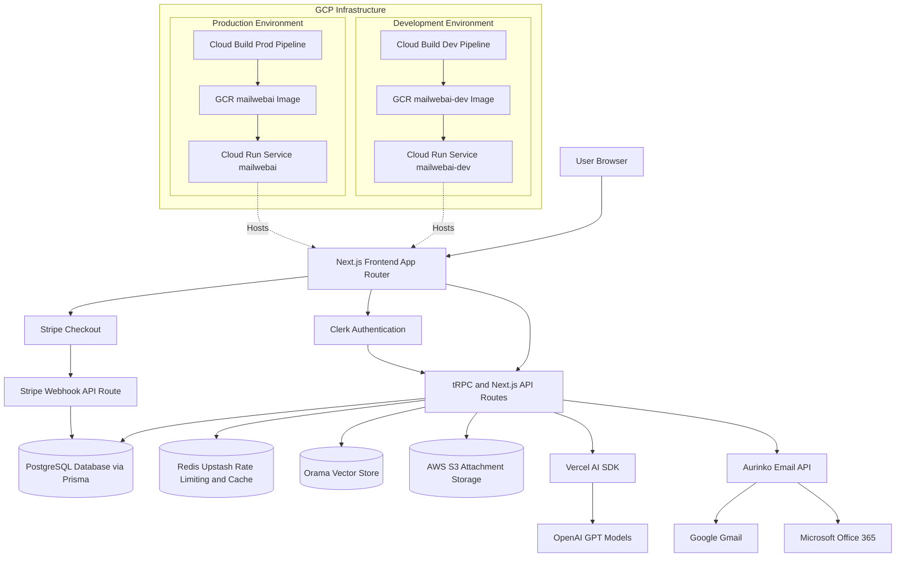

## 3. Technology Stack

### Frontend
- **Framework:** [Next.js 14](https://nextjs.org/) (App Router)
- **Language:** TypeScript
- **Styling:** 
  - **Tailwind CSS** for utility-first styling.
  - **Tailwind CSS Animate** for animation utilities.
- **UI Components:**
  - **Shadcn UI** (built on **Radix UI** primitives) for accessible, customizable components.
  - **Framer Motion** for complex animations.
  - **Sonner** for toast notifications.
  - **Lucide React** for icons.
- **State Management:** 
  - **Jotai** for atomic global state.
  - **TanStack Query (React Query)** for async state and data fetching.
- **Editor:** **Tiptap** / **Novel** for the rich text email editor.

### Backend (BFF - Backend for Frontend)
- **API Layer:** 
  - **tRPC (v11)** for end-to-end type-safe APIs between client and server.
  - **Next.js API Routes** for external webhooks (e.g., Stripe, Aurinko) and specific REST endpoints.
- **Database ORM:** **Prisma** for type-safe database access.
- **AI & ML:**
  - **Vercel AI SDK** for streaming AI responses.
  - **OpenAI** (GPT-4o / GPT-4-turbo) for core intelligence.
  - **Orama** for client-side vector search and RAG (Retrieval-Augmented Generation).
  - **LangChain** (concepts used for context window management).

### Database & Storage
- **Primary Database:** **PostgreSQL** (Managed).
- **Caching & Rate Limiting:** **Redis** (Upstash) used for:
  - API Rate Limiting.
  - User-specific request limits.
  - Caching ephemeral data.
- **Vector Storage:** **Orama** (In-memory/Persisted on Edge) for efficient vector search on emails.
- **Object Storage:** **AWS S3** (via SDK) for storing large email attachments.

## 4. Infrastructure & DevOps

The application is hosted fully on Google Cloud Platform (GCP).

### CI/CD Pipeline
- **Tool:** **Google Cloud Build**
- **Process:**
  1.  Triggered on git commits.
  2.  Builds a **Docker** container using the repository's `Dockerfile`.
  3.  Pushes the image to **Google Container Registry (GCR)** (`gcr.io/mailwebai/...`).
  4.  Deploys the new image to **Google Cloud Run**.

### Environments
The project is configured with two distinct environments, each with its own build pipeline and deployment service:

1.  **Development Environment**
    -   **Config File:** `cloudbuild-dev.yaml`
    -   **Service Name:** `mailwebai-dev` (Cloud Run)
    -   **Registry:** `gcr.io/mailwebai/mailwebai-dev`
    -   **Purpose:** Rapid iteration, testing new features.

2.  **Production Environment**
    -   **Config File:** `cloudbuild.yaml`
    -   **Service Name:** `mailwebai` (Cloud Run)
    -   **Registry:** `gcr.io/mailwebai/mailwebai`
    -   **Purpose:** Stable, user-facing application.

## 5. External Services & Integrations

### Authentication
-   **Provider:** **Clerk**
-   **Role:** Handles user sign-up, sign-in, and session management.
-   **Integration:** Middleware protects routes; user IDs are mapped to the local database `User` model.

### Email Engine
-   **Provider:** **Aurinko** (Primary)
-   **Role:** 
    -   Acts as the unified API layer for Gmail and Office 365.
    -   Handles OAuth token exchange and refresh.
    -   Provides webhooks for real-time email syncing (`account.ts`).
    -   Note: **Nylas** references exist in the codebase but Aurinko is currently the active driver for account synchronization and sending.

### Payments
-   **Provider:** **Stripe**
-   **Role:** Handles subscription billing (Pro vs. Free tiers).
-   **Webhooks:** Listens for subscription events to update access rights in the local database.

## 6. Key Architecture Patterns

-   **RAG (Retrieval-Augmented Generation):**
    When a user asks a question, the system searches the local Orama vector index for relevant emails, retrieves them, and feeds them as context to the OpenAI model to generate an accurate answer.

-   **Email Synchronization:**
    A sophisticated sync engine (`sync-to-db.ts`) runs partially via webhooks and partially via user-triggered actions to keep the local Postgres database in sync with the remote email provider. It handles "Delta Tokens" to efficiently fetch only new changes.

-   **Type Safety:**
    End-to-end type safety is guaranteed from the database (Prisma) to the backend (tRPC) to the frontend (React), minimizing runtime errors.


# Email Sync: How It Works

This guide explains the email synchronization process in simple terms for two scenarios: when a user first connects their account, and when they receive new emails later.

---

# 1. A New User (Initial Sync)

When a user links their email account (Gmail or Outlook) to our app for the first time, we perform an "Initial Sync". This is like downloading a snapshot of their recent history.

**Goal:** Fetch the last 3 days of emails so the user sees data immediately.

## Flow Diagram

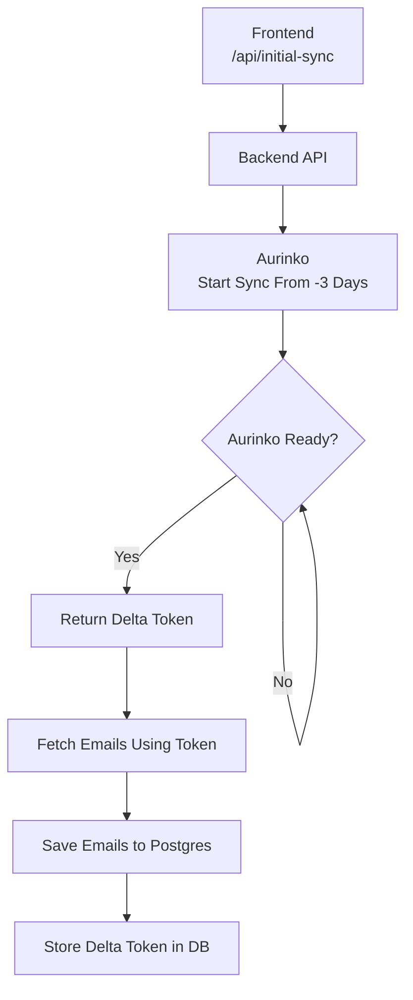

## Step-by-Step

1. **Start the Job**
   - Frontend calls `/api/initial-sync`
   - Backend requests Aurinko to prepare emails from 3 days ago

2. **Wait for Readiness**
   - Aurinko processes in background
   - Backend polls until ready
   - Aurinko returns a **Delta Token**
   - Delta Token acts as a bookmark

3. **Download Emails**
   - Fetch emails using the token
   - Store them in PostgreSQL

4. **Save Bookmark**
   - Store Delta Token in database
   - Future syncs use this token

---

# 2. Existing User (Real-Time Sync via Webhooks)

After initial sync, updates are handled incrementally using webhooks.

**Goal:** Instantly process new emails.

## Flow Diagram

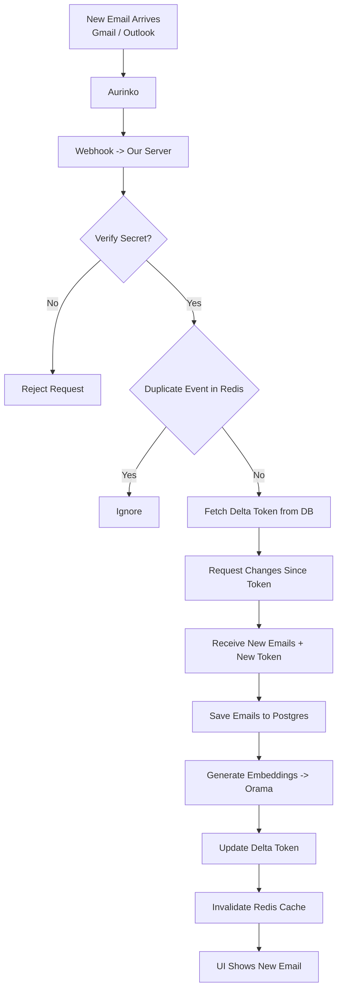

## Step-by-Step

1. **Webhook Trigger**
   - Aurinko sends event when new email arrives

2. **Security & Dedup**
   - Validate webhook signature
   - Use Redis to ignore duplicate events

3. **Fetch Incremental Changes**
   - Retrieve stored Delta Token
   - Request only changes since that token
   - Receive updated emails + new Delta Token

4. **Persist Updates**
   - Save new emails in PostgreSQL
   - Generate embeddings (Orama vector DB)
   - Update Delta Token

5. **Refresh UI**
   - Invalidate Redis cache
   - User sees updated inbox

---

# 3. Displaying Emails (Cache-First Strategy)

The app uses a Cache-First / Stale-While-Revalidate approach.

## Flow Diagram

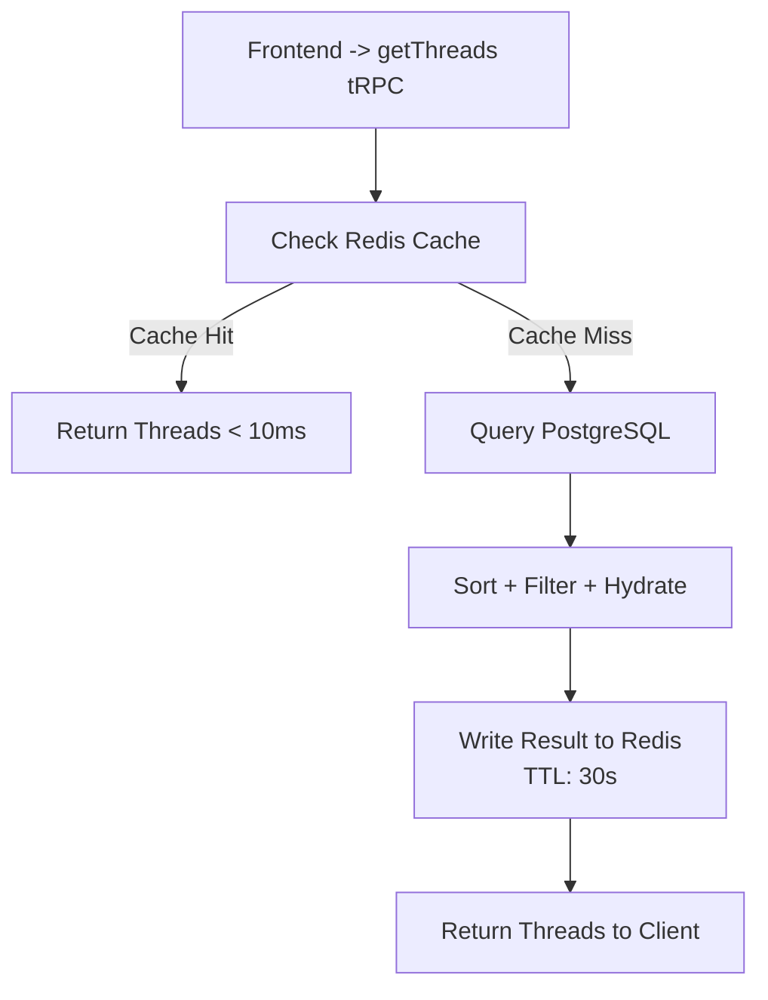

## Flow Explanation

1. **Cache Check**
   - Redis key: `threads:{accountId}:{tab}:{done}`
   - If found → return instantly (<10ms)

2. **Database Fallback**
   - Query PostgreSQL
   - Apply filters (inbox/sent/draft)
   - Sort by latest message date

3. **Cache Repopulation**
   - Store result in Redis (TTL: 30s)
   - Prevents thundering herd issue

---

## 4. Real-Time Synchronization (Technical Implementation)

The system achieves "real-time" updates without WebSockets by combining **optimistic UI updates** with **Server-Side Cache Invalidation** and **Short-Interval Polling**.

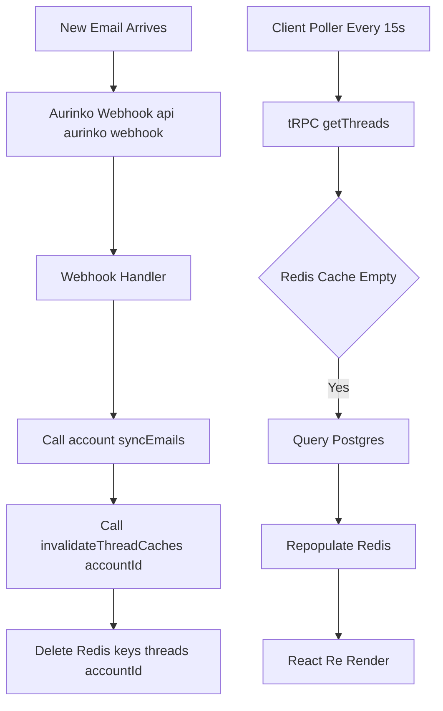

### Component: `useThreads` Hook (`src/app/mail/use-threads.tsx`)

```typescript
const { data: threads } = api.mail.getThreads.useQuery(
    queryInput,
    { 
        refetchInterval: 15000, // Polling frequency: 15 seconds
        placeholderData: (e) => e 
    }
)
```

### The Invalidation Cycle (Data Flow)

1.  **Event Trigger**: A new email arrives via **Aurinko Webhook** (`api/aurinko/webhook`).
2.  **Invalidation Logic**:
    *   The webhook handler calls `account.syncEmails()`.
    *   Upon success, it executes `invalidateThreadCaches(accountId)` (`src/lib/email-cache.ts`).
    *   **Action**: Executing `DEL threads:{accountId}:*` removes *all* cached thread lists for that user.
3.  **Client Re-fetch**:
    *   The browser's background poller (`tanstack-query`) fires every 15s.
    *   **Next Poll**:
        *   The tRPC procedure runs.
        *   Redis Cache is now **empty** (due to step 2).
        *   The system forces a fresh DB read, picking up the new email.
        *   Redis is re-populated with the new list.
    *   **UI Update**: The React component re-renders with the new thread.


# AI Assistant Architecture

This document details the technical architecture of the AI Assistant in the **MailWebAI** application. The assistant is a full-stack feature integrating a Chat UI, server-side LLM processing with RAG (Retrieval-Augmented Generation), and client-side state management to control the application.

---

## High-Level Architecture

The AI Assistant operates on a **Client-Server-AI Loop**:

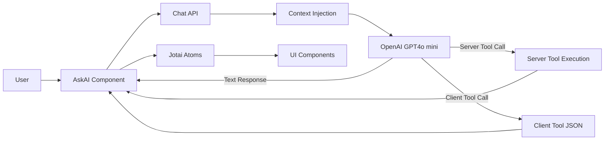

1. User Input: User types a command in the AskAI component.
2. Server-side Processing: The request is sent to /api/chat.
3. Context Injection: The server fetches RAG context and current viewing context and injects them into the System Prompt.
4. LLM Decision: OpenAI (GPT-4o-mini) decides to either answer textually or call a Tool.
5. Tool Execution:
   - Server-Side Tools executed immediately.
   - Client-Side Tools return structured JSON.
6. Client-Side Action: Dispatched to global state (Jotai).
7. UI Reaction: Components react instantly.

---

## Core Components

---

### 1. Frontend: AskAI Component

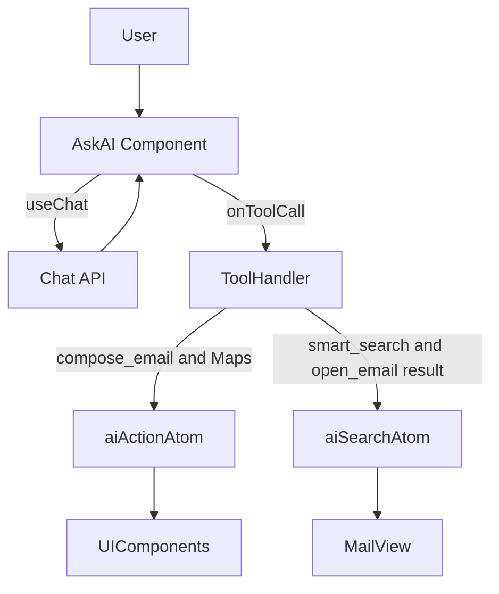

Location: src/app/mail/components/ask-ai.tsx

- Uses useChat (Vercel AI SDK)
- Uses useAIAction & useAISearch (Jotai atoms)
- Handles tool calls
- Dispatches client-side actions
- Displays feedback toasts
- Waits for server tool results when required

---

### 2. Backend: Chat API

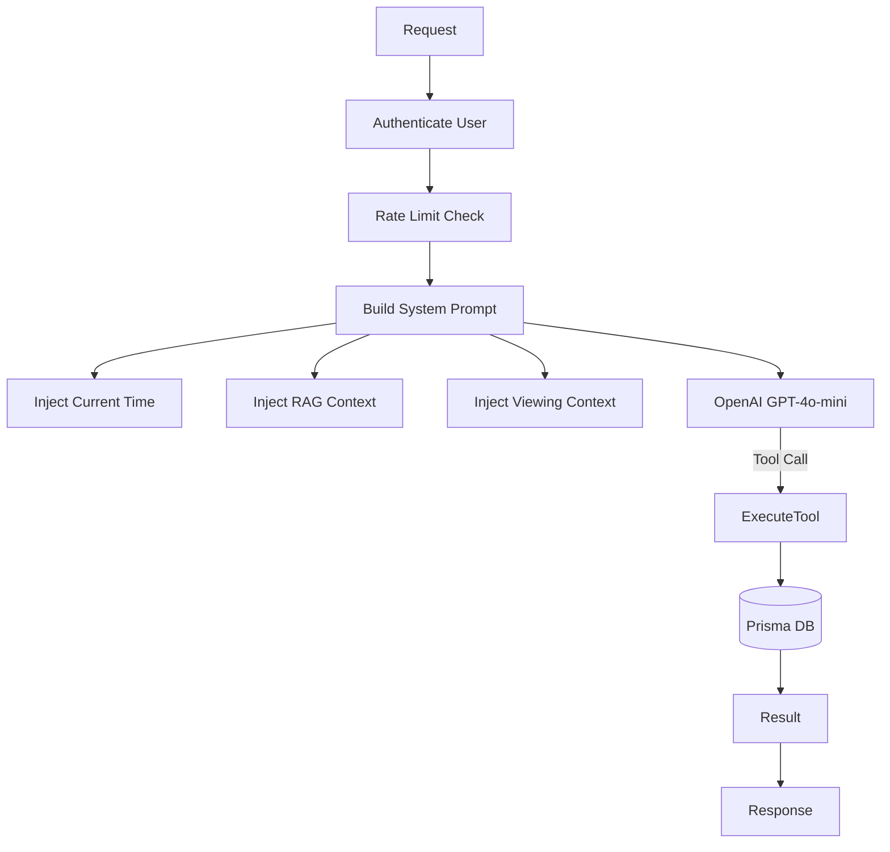

Location: src/app/api/chat/route.ts

- Authenticates user
- Enforces 30 RPM rate limit
- Dynamically builds system prompt
- Injects Current Time, RAG Context, Viewing Context
- Defines tools using Zod schemas
- Executes server-side tools directly

---

### 3. State Management: Atoms

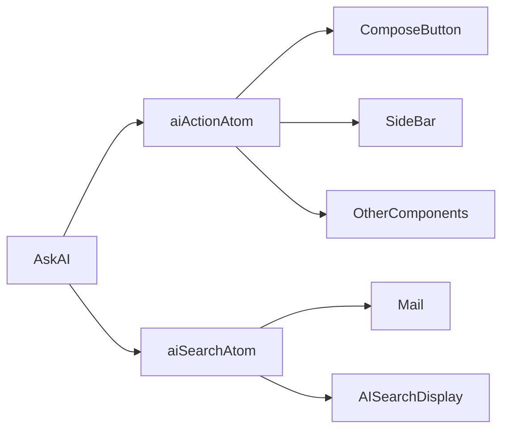

Location: src/app/mail/use-ai-action.ts

- aiActionAtom: Global event bus
- aiSearchAtom: Holds search query + threadIds
- Fully decoupled architecture

---

### 4. RAG Engine: Orama

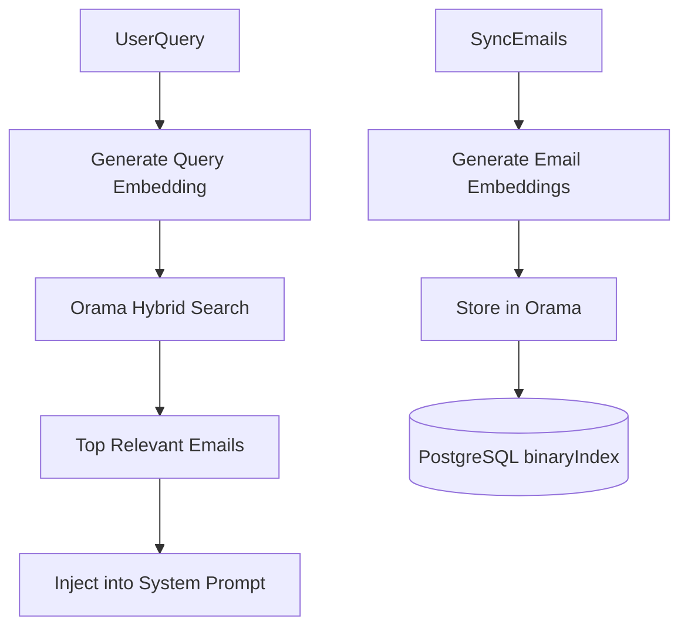

Location: src/lib/orama.ts

- Vector DB: Orama
- Fields indexed: subject, body, from, to, sentAt
- Embeddings via text-embedding-3-small
- Hybrid search (vector + keyword)
- Injected into START CONTEXT BLOCK
- AI restricted to provided context

---

# Feature Deep Dives

---

## Feature Deep Dives

### 1. Compose & Send
**User Query:** *"Send an email to John about the meeting"*

1.  **LLM:** Decides to call `compose_email` with args: `{ to: ["john@example.com"], subject: "Meeting", body: "..." }`.
2.  **Client Dispatch:** `AskAI` receives this tool call and sets `aiActionAtom` to this object.
3.  **UI Reaction (`ComposeButton.tsx`):**
    * `ComposeButton` has a `useEffect` listening to `aiActionAtom`.
    * Detects `type: 'compose_email'`.
    * **Opens Drawer:** Sets `open(true)`.
    * **Auto-Fill:** It progressively fills the fields (`setToValues`, `setSubject`) with slight delays to create a "ghost-typing" visual effect, making the user see the AI working.
    * **Body Handling:** Passes the generated body to the `EmailEditor` component.

### 2. RAG & Search (Question Answering)
**User Query:** *"Find the email from Sarah about the project"*

1.  **LLM:** Calls `smart_search` tool with args: `{ from: "Sarah", keyword: "project" }`.
2.  **Server Execution:**
    * The `execute` function in `/api/chat` constructs a **Prisma Query**.
    * It filters by Sender (`from` OR `address` match) and Body/Subject content.
    * Returns a list of matching `threadIds` and metadata.
3.  **Client Update:**
    * The tool result (JSON) is streamed back to `AskAI`.
    * `AskAI` updates the `aiSearchAtom` with `{ query: "from: Sarah...", threadIds: [...] }`.
    * `AskAI` sets `threadId` to `null` to close any open email.
4.  **UI Render:**
    * `Mail` component sees `aiSearchAtom` is active.
    * Swaps the main view to `AISearchDisplay`, showing only the returned threads.

### 3. Navigate & Open
**User Query:** *"Open the latest email from David"*

1.  **LLM:** Calls `open_email` tool with args: `{ from: "David" }`.
2.  **Server Execution:**
    * Queries the DB for the most recent thread where the sender matches "David".
    * Returns `{ success: true, threadId: "thread_123" }`.
3.  **Client Update:**
    * `AskAI` receives the result.
    * Sets `threadId` to `"thread_123"`.
    * Clears `aiSearchAtom`.
4.  **UI Render:** The `Mail` component detects a `threadId` and renders the `ThreadDisplay` view seamlessly.

### 4. Context Awareness
**User Query:** *"Reply to this"*

1.  **Frontend:** When calling `/api/chat`, `AskAI` sends the current `threadId` (from the URL/state) in the request body.
2.  **Backend:**
    * `POST /api/chat` sees `threadId`.
    * Queries DB for that specific thread.
    * Adds a text block to the System Prompt:
        ```text
        CURRENTLY VIEWING EMAIL:
        - Subject: Project Update
        - From: Sarah <sarah@example.com>
        - Snippet: Hey, just wanted to let you know...
        ```
3.  **LLM:** Understands "this" refers to the email in the context.
4.  **Action:** Calls `compose_email` with `to: "sarah@example.com"`, `subject: "Re: Project Update"`, and generates a relevant reply body based on the snippet.

### 5. Filters via Assistant
**User Query:** *"Show only unread emails from this week"*

1.  **LLM:** Calls `smart_search` with `{ labels: ["unread"], dateFrom: "2023-10-01" }`.
2.  **Server:** Executes Prisma query filtering by `sysLabels` (for 'unread') and `lastMessageDate`.
3.  **Client:** Returns results.
4.  **Syncs UI State:** `AskAI` also calls `setMailFilter` (another global atom).
5.  **UI Reaction:** The `FilterBar` component listens to this atom and visually updates its buttons to show "Unread" and the date range as active filters, keeping the UI state in sync with the AI's actions.


# API Rate Limiting Architecture

This document details the rate limiting architecture used in the MailWebAI application to ensure stability, prevent abuse, and manage OpenAI API costs/limits.

## Overview

The application employs a **Dual-Layer Rate Limiting Strategy**:

1.  **Per-User Rate Limiting:** Protects the application server from abuse by individual users.
2.  **Global OpenAI Rate Limiting:** Protects the OpenAI API quota and limits costs by managing the aggregate load from all users.

Both layers utilize **Redis (Upstash)** for distributed state management, ensuring limits are enforced across serverless function invocations. An **In-Memory fallback** is included for resilience if Redis is unavailable.

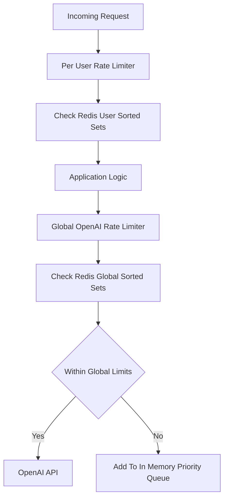

---

## 1. Per-User Rate Limiting (The "Outer Guard")

This layer runs first when a request hits an API endpoint. It ensures no single user can flood the system.

*   **Location:** `src/lib/user-rate-limiter.ts`
*   **Limit:** 30 Requests Per Minute (RPM) per user.
*   **Mechanism:** Queue-Based Sliding Window.
    *   When a request arrives, it checks the user's recent request timestamps in Redis.
    *   **If under limit:** Request proceeds immediately.
    *   **If over limit:** The request is **queued** (held in an async wait loop). It polls every 500ms to see if a slot has opened up in the sliding window.
    *   **Timeout:** If a slot doesn't open within **15 seconds**, the request is rejected with a `UserRateLimitError`.
*   **Storage:** Redis Sorted Sets (`user:rpm:{userId}`).
    *   **Score:** Timestamp (ms).
    *   **Member:** Unique Request ID.
    *   **TTL:** 120 seconds (auto-cleanup).

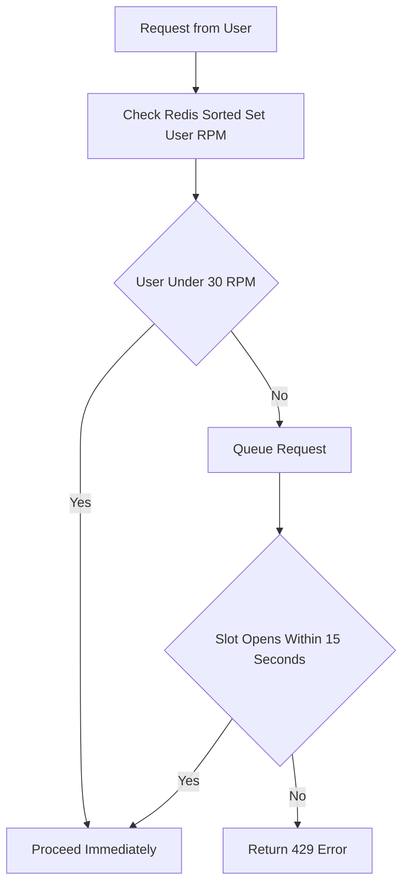

### Usage in Codebase

Used at the beginning of AI-heavy API routes:

*   **Chat:** `src/app/api/chat/route.ts`
*   **Completion:** `src/app/api/completion/route.ts`
*   **AI Search:** `src/app/api/ai-search/route.ts`

```typescript
// Example usage in API route
import { acquireUserRateLimit } from "@/lib/user-rate-limiter";

export async function POST(req: Request) {
  const { userId } = await auth();
  
  // This will wait or queue if user is sending too fast
  await acquireUserRateLimit(userId); 

  // Proceed with expensive logic...
}
```

---

## 2. Global OpenAI Rate Limiting (The "Inner Guard")

This layer wraps the actual calls to OpenAI. It ensures the application stays within the platform's TPM (Tokens Per Minute) and RPM limits.

*   **Location:** `src/lib/rate-limiter.ts` & `src/lib/openai-client.ts`
*   **Limits:** 
    *   **5,000 RPM** (Requests Per Minute)
    *   **2,000,000 TPM** (Tokens Per Minute)
*   **Mechanism:** Singleton Priority Queue with Token Estimation.
    *   Implemented as a Singleton (`OpenAIRateLimiter.getInstance()`).
    *   Requests are assigned a **Priority**:
        *   `high`: Interactive user chat.
        *   `normal`: Standard completions.
        *   `low`: Background tasks (e.g., embedding generation).
    *   Before making a call, the system estimates the token cost (User prompt + System prompt + History).
    *   If limits are exceeded, the request is queued internally in memory, waiting for a global slot.
*   **Storage:** Redis Sorted Sets.
    *   `ratelimit:openai:requests` (Global request timestamps)
    *   `ratelimit:openai:tokens` (Global token usage timestamps)

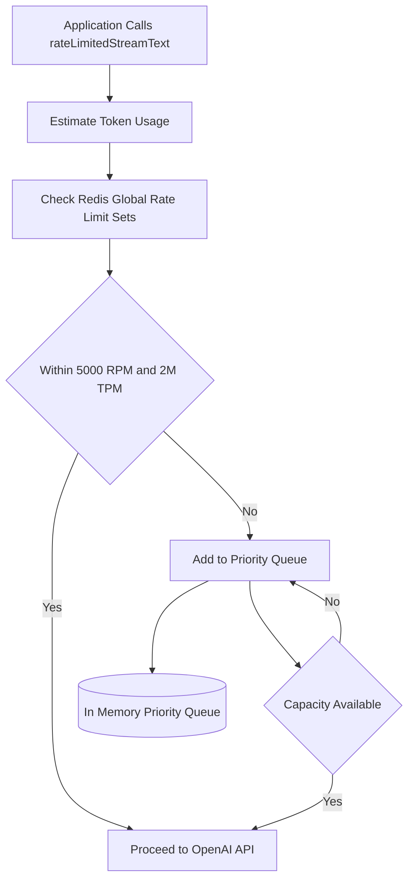

### Usage in Codebase

This is centralized in `src/lib/openai-client.ts`. We export custom wrappers that automatically enforce these limits.

*   **`rateLimitedStreamText`:** Replacement for Vercel AI SDK's `streamText`.
*   **`rateLimitedGetEmbeddings`:** Wrapper for embedding generation.

```typescript
// Example usage in src/lib/openai-client.ts
export async function rateLimitedStreamText(options, priority) {
  const limiter = OpenAIRateLimiter.getInstance();
  
  // Estimate tokens and wait for global capacity
  await limiter.acquire(priority, estimatedTokens);
  
  // Make actual OpenAI call
  return streamText(options);
}
```

---

## Summary Diagram logic

1.  **Incoming Request** (e.g., User sends chat message)
    ↓
2.  **`acquireUserRateLimit(userId)`**
    *   *Check:* Is User < 30 RPM?
    *   *Wait:* If NO, hold request for up to 15s.
    *   *Reject:* If timeout, return 429.
    ↓
3.  **Application Logic** (DB lookups, RAG, etc.)
    ↓
4.  **`rateLimitedStreamText()`**
    *   *Estimate:* Calculate expected token usage.
    *   *Check:* Is Global OpenAI < 5000 RPM & < 2M TPM?
    *   *Queue:* If NO, add to internal priority queue.
    ↓
5.  **OpenAI API Call** (Executed when global capacity allows)

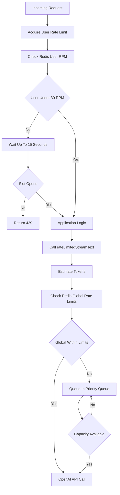


# Email Sending & Attachment Architecture

This document outlines the architecture for sending emails, specifically focusing on how attachments are processed based on their file size.

## Architecture Overview

The email sending process handles attachments dynamically to ensure efficient delivery and compliance with provider limits.

### Attachment Handling Logic

1.  **Small Files (< 20MB)**:
    *   Files are read client-side.
    *   Converted to **Base64** strings.
    *   Sent directly as part of the API payload in the `attachments` array.
    *   **Limit**: The total size of all small attachments must not exceed 20MB.

2.  **Large Files (> 20MB)**:
    *   Files are identified as "large" immediately upon selection.
    *   **Uploaded to AWS S3** via a signed URL.
    *   Once uploaded, a public link to the file is generated.
    *   This link is appended to the email **body** (HTML).
    *   The file is *not* sent as a standard MIME attachment, but as a downloadable link.

## Process Flow Diagram

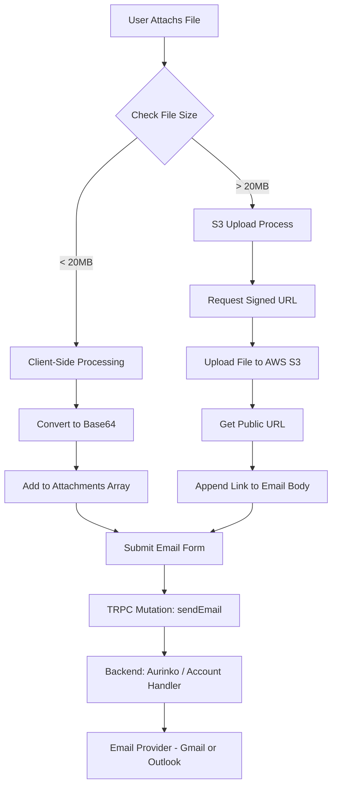

## Technical Implementation Details

### Frontend (`ComposeButton`)
- **File Selection**: Separates files into `smallFiles` and `largeFiles`.
- **Large Files**: Triggers `uploadToS3` (utilizing `/api/upload` for presigned URLs).
- **Small Files**: Uses `FileReader` to generate Base64 strings.
- **Validation**: Prevents submission if small attachments total > 20MB.

### Backend (`mailRouter`)
- Receives the email payload.
- `attachments` array contains only the Base64 content of small files.
- Large files are already part of the `body` string as HTML links (e.g., `<a href="...">filename</a>`).
- Forwards the payload to the `Account` class which interfaces with the Aurinko API.

### Storage
- **AWS S3**: Used for storing large files.
- **Retention**: (Note: specific retention policies should be configured on the S3 bucket).


## Improvements Achieved with Additional Time

With additional development time, the following enhancements were successfully implemented:

- **Ensured scalability** to support future growth and increased user demand.
- **Established separate testing and production environments** to improve deployment reliability and quality assurance.
- **Integrated Redis** to reduce latency and enhance overall system performance.
- **Resolved existing bugs** to improve application stability and reliability.
- **Enhanced the user interface (UI)** to deliver a more polished and visually appealing experience.
- **Implemented API rate limiting** to improve security, prevent abuse, and ensure fair usage.


