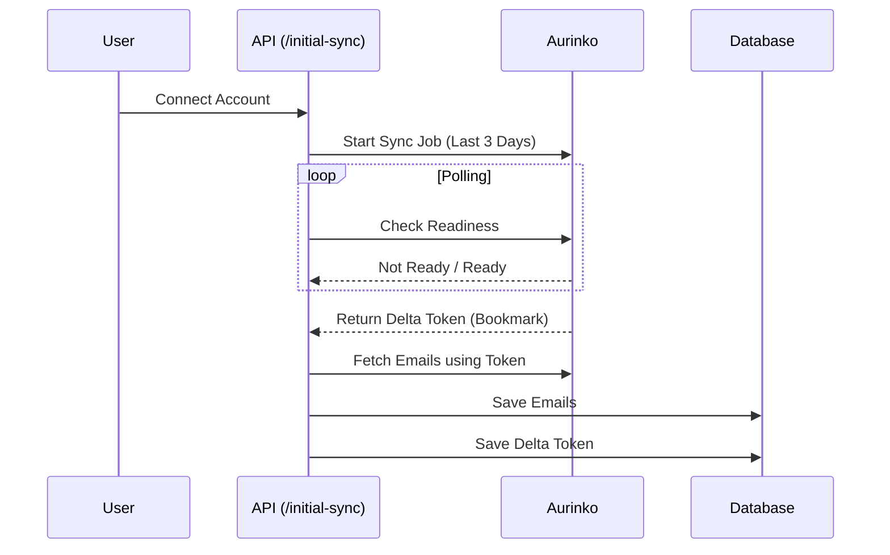
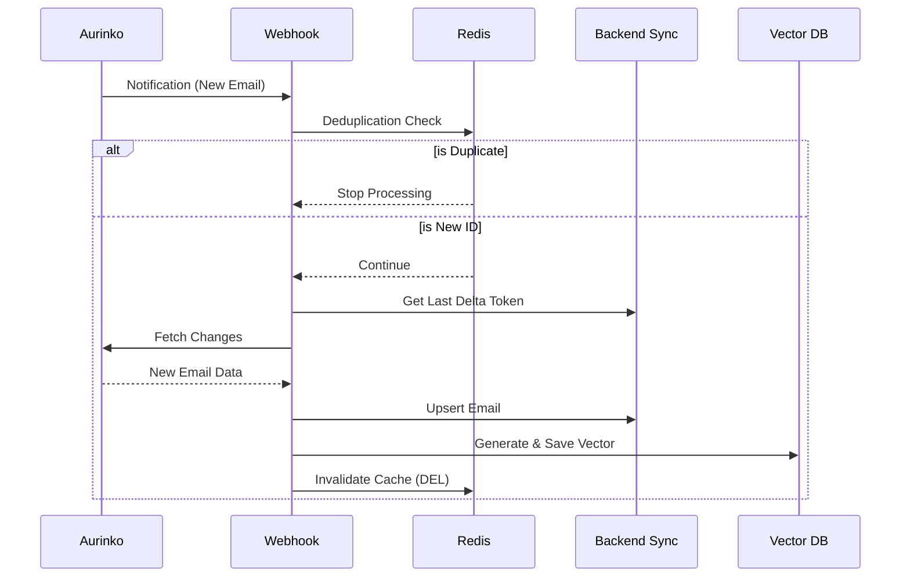
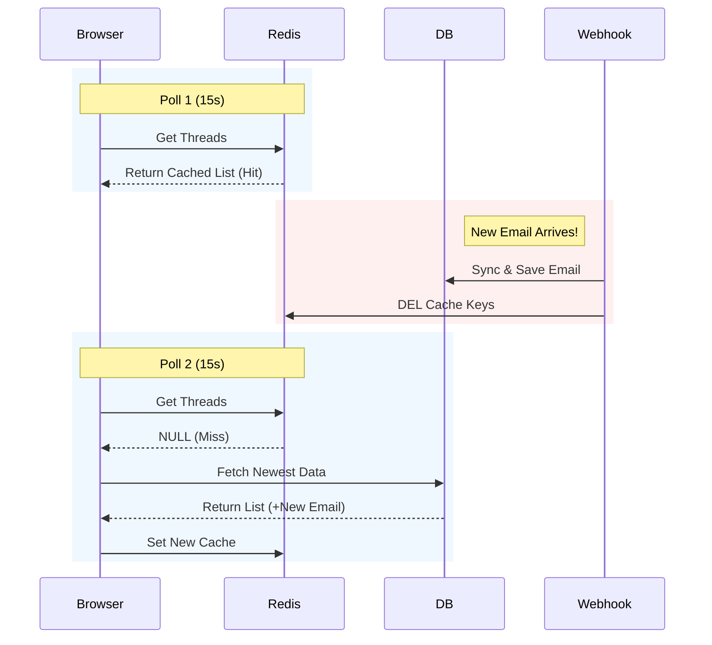

# Email Sync: How It Works

This guide explains the email synchronization process in simple terms for two scenarios: when a user first connects their account, and when they receive new emails later.

## 1. A New User (Initial Sync)

When a user links their email account (Gmail or Outlook) to our app for the first time, we perform an "Initial Sync". This is like downloading a snapshot of their recent history.

**The Goal:** Get the last 3 days of emails so the user sees data immediately.



1.  **Start the Job**:
    *   The frontend calls our API (`/api/initial-sync`).
    *   We tell our email provider (Aurinko): "Prepare the emails for this account starting from 3 days ago."

2.  **Wait for Readiness**:
    *   Aurinko starts working in the background.
    *   We check every second: "Are you ready?"
    *   Once Aurinko says "Ready", it gives us a **Delta Token**.
    *   *Note: A Delta Token is like a bookmark. It marks the exact point in time where this sync finished.*

3.  **Download Emails**:
    *   We use the token to download all the emails from those 3 days.
    *   We save them to our database (Postgres).

4.  **Save the Bookmark**:
    *   We save the **Delta Token** in our database.
    *   This is crucial. It ensures that next time, we only ask for emails that arrived *after* this moment.

---

## 2. An Existing User (Real-Time Sync)

Once the initial sync is done, we don't need to ask for "all emails" ever again. We now rely on **Webhooks** (real-time notifications) to stay updated.

**The Goal:** Update the app the instant a new email arrives.



1.  **The Notification (Webhook)**:
    *   A new email arrives in the user's Gmail/Outlook.
    *   Aurinko sends a message to our server: "Something changed for User X!"

2.  **Verification & Deduplication**:
    *   **Security Check**: We check a secret code to make sure the message is really from Aurinko.
    *   **Dedup Check**: Sometimes webhooks fire twice by accident. We use Redis to ask: "Have we processed this exact event in the last 5 minutes?"
        *   If yes -> We ignore it.
        *   If no -> We proceed.

3.  **Fetch Only Changes**:
    *   We look up the user's **Delta Token** (the bookmark we saved earlier) from our database.
    *   We ask Aurinko: "Give me only the changes that happened *since* this bookmark."
    *   Aurinko gives us the 1 or 2 new emails and a **New Delta Token**.

4.  **Update Database**:
    *   We save the new emails to Postgres.
    *   We run them through our AI engine (generate embeddings and store in Orama vector DB).
    *   We update the **Delta Token** in our database to the new one.

5.  **Refresh the UI**:
    *   We tell the app to clear its cache.
    *   The user sees the new email appear in their inbox instantly.

---

## 3. Displaying Emails (Fetching Strategy)

When the application loads, it employs a **Cache-First / Stale-While-Revalidate** strategy to serve content instantly while maintaining data consistency.

```mermaid
flowchart TD
    A[Frontend ThreadList] -->|tRPC getThreads| B{Check Redis Cache}
    B -- Hit --> C[Return Cached Data]
    C -->|Speed: <10ms| A
    B -- Miss --> D[Query PostgreSQL DB]
    D -->|Fetch Top 50 Threads| E[Result]
    E -->|Save to Redis (TTL 30s)| B
    E -->|Return Data| A
```

### A. The tRPC Procedure (`getThreads`)
The frontend component (`ThreadList`) calls the `getThreads` tRPC query. The backend logic (`src/server/api/routers/mail.tsx`) executes the following flow:

1.  **Cache Hit Check**:
    *   Constructs a Redis key: `threads:{accountId}:{tab}:{done}`.
    *   Attempts to retrieve the pre-serialized list of threads.
    *   **Latency**: < 10ms.
    *   **Result**: If found, returns immediately. No database connection is opened.

2.  **Cache Miss / Database Fallback**:
    *   If the cache is empty, it executes a `db.thread.findMany` query against **PostgreSQL**.
    *   **Filtering**: Applies `where: { inboxStatus: true }` (or draft/sent) and sorts by `orderBy: { lastMessageDate: 'desc' }`.
    *   **Hydration**: Includes the latest email for snippets and sender details.

3.  **Cache Re-Population**:
    *   The result from Postgres is written back to Redis with a **30-second TTL** (`TTL_THREAD_LIST`).
    *   This prevents "thundering herd" issues where multiple browser tabs might hit the DB simultaneously.

---

## 4. Real-Time Synchronization (Technical Implementation)

The system achieves "real-time" updates without WebSockets by combining **optimistic UI updates** with **Server-Side Cache Invalidation** and **Short-Interval Polling**.



### Component: `useThreads` Hook (`src/app/mail/use-threads.tsx`)

```typescript
const { data: threads } = api.mail.getThreads.useQuery(
    queryInput,
    { 
        refetchInterval: 15000, // Polling frequency: 15 seconds
        placeholderData: (e) => e 
    }
)
```

### The Invalidation Cycle (Data Flow)

1.  **Event Trigger**: A new email arrives via **Aurinko Webhook** (`api/aurinko/webhook`).
2.  **Invalidation Logic**:
    *   The webhook handler calls `account.syncEmails()`.
    *   Upon success, it executes `invalidateThreadCaches(accountId)` (`src/lib/email-cache.ts`).
    *   **Action**: Executing `DEL threads:{accountId}:*` removes *all* cached thread lists for that user.
3.  **Client Re-fetch**:
    *   The browser's background poller (`tanstack-query`) fires every 15s.
    *   **Next Poll**:
        *   The tRPC procedure runs.
        *   Redis Cache is now **empty** (due to step 2).
        *   The system forces a fresh DB read, picking up the new email.
        *   Redis is re-populated with the new list.
    *   **UI Update**: The React component re-renders with the new thread.

**Why this approach?**
*   **Reliability**: WebSockets require maintaining persistent connections which can be fragile on serverless/edge environments.
*   **Scalability**: Redis absorbs 99% of read traffic. The DB is only touched when data *actually changes* (cache invalidation) or when the TTL expires.
