# MailWebAI — System Design Architecture

> Comprehensive system design covering infrastructure, data flow, caching, rate limiting, AI/ML pipeline, billing, and deployment.

---

## 1. High-Level System Architecture

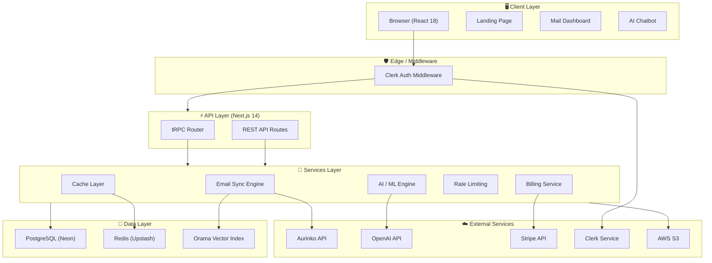

---

## 2. Request Flow & Authentication

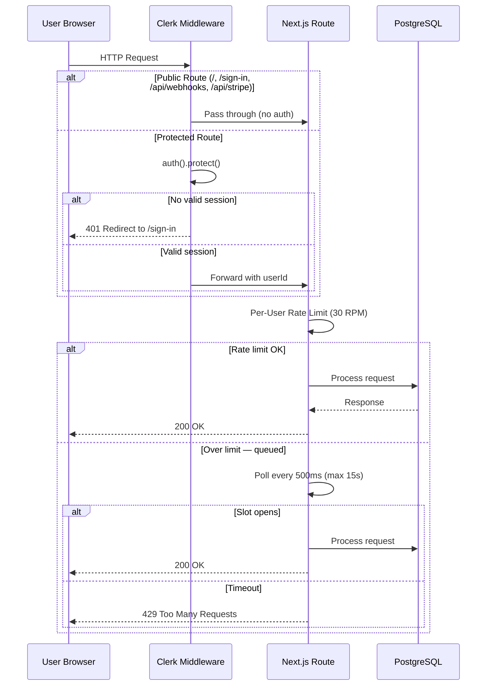

---

## 3. Data Model (ER Diagram)

```mermaid
erDiagram
    User {
        string id PK
        string emailAddress UK
        string firstName
        string lastName
        string imageUrl
        string stripeSubscriptionId FK
        enum role
    }

    Account {
        string id PK
        string userId FK
        json binaryIndex
        string token UK
        string provider
        string emailAddress
        string name
        string nextDeltaToken
    }

    Thread {
        string id PK
        string subject
        datetime lastMessageDate
        string accountId FK
        boolean done
        boolean inboxStatus
        boolean draftStatus
        boolean sentStatus
    }

    Email {
        string id PK
        string threadId FK
        datetime sentAt
        string subject
        string body
        string bodySnippet
        boolean hasAttachments
        enum emailLabel
        string fromId FK
    }

    EmailAddress {
        string id PK
        string name
        string address
        string accountId FK
    }

    EmailAttachment {
        string id PK
        string name
        string mimeType
        int size
        string emailId FK
    }

    StripeSubscription {
        string id PK
        string userId FK
        string subscriptionId UK
        string customerId
        datetime currentPeriodEnd
    }

    ChatbotInteraction {
        string id PK
        string day
        int count
        string userId FK
    }

    User ||--o{ Account : owns
    User ||--o| StripeSubscription : subscribes
    User ||--o| ChatbotInteraction : tracks
    Account ||--o{ Thread : contains
    Account ||--o{ EmailAddress : has
    Thread ||--o{ Email : contains
    Email }o--|| EmailAddress : from
    Email }o--o{ EmailAddress : to
    Email }o--o{ EmailAddress : cc
    Email ||--o{ EmailAttachment : has
```

---

## 4. Email Sync Pipeline

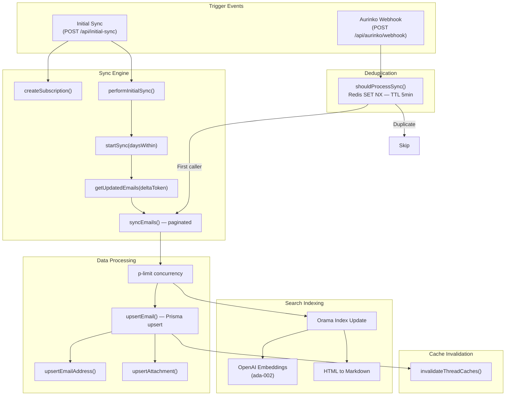

---

## 5. AI / ML Architecture

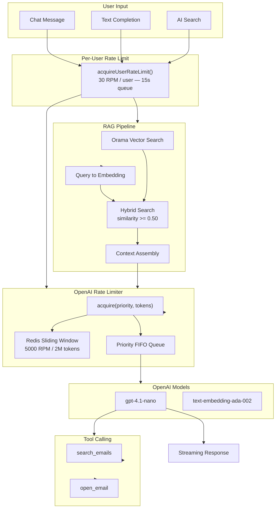

---

## 6. Caching Strategy

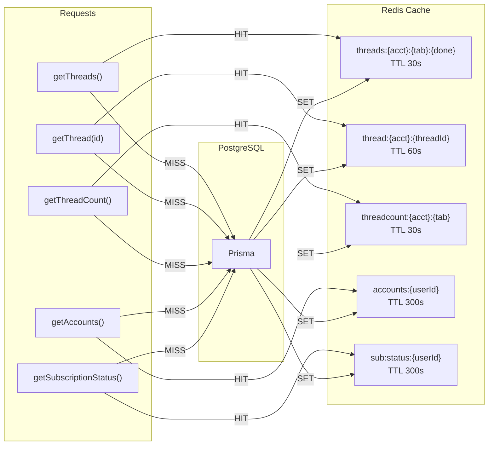

### Cache Invalidation Triggers

| Event | Keys Invalidated |
|---|---|
| Email sync | `threads:*`, `thread:*`, `threadcount:*` for account |
| Thread done/undone | `threads:*`, `thread:*`, `threadcount:*` for account |
| Mark as read | `thread:{id}` + `threads:*` lists |
| Stripe webhook | `sub:status:{userId}` |

---

## 7. Rate Limiting Architecture

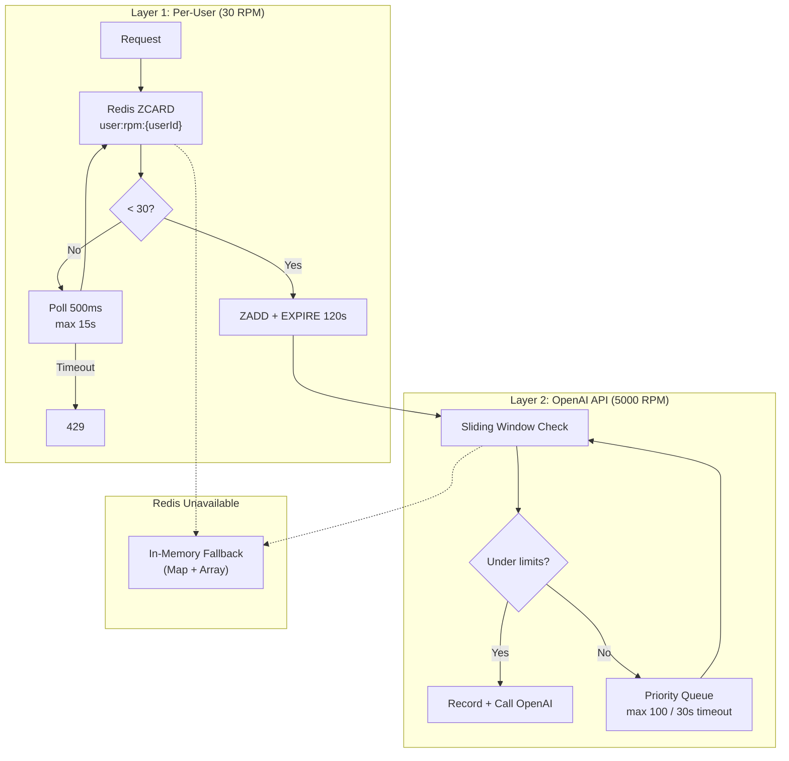

### Priority Levels

| Priority | Used By |
|---|---|
| `high` | Reserved |
| `normal` | Chat responses |
| `low` | Completion, embeddings |

---

## 8. API Route Map

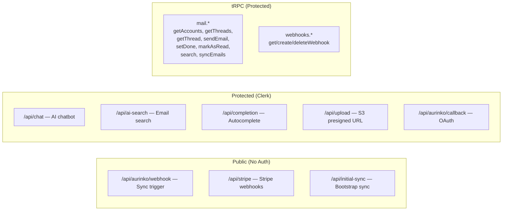

---

## 9. Frontend Component Architecture

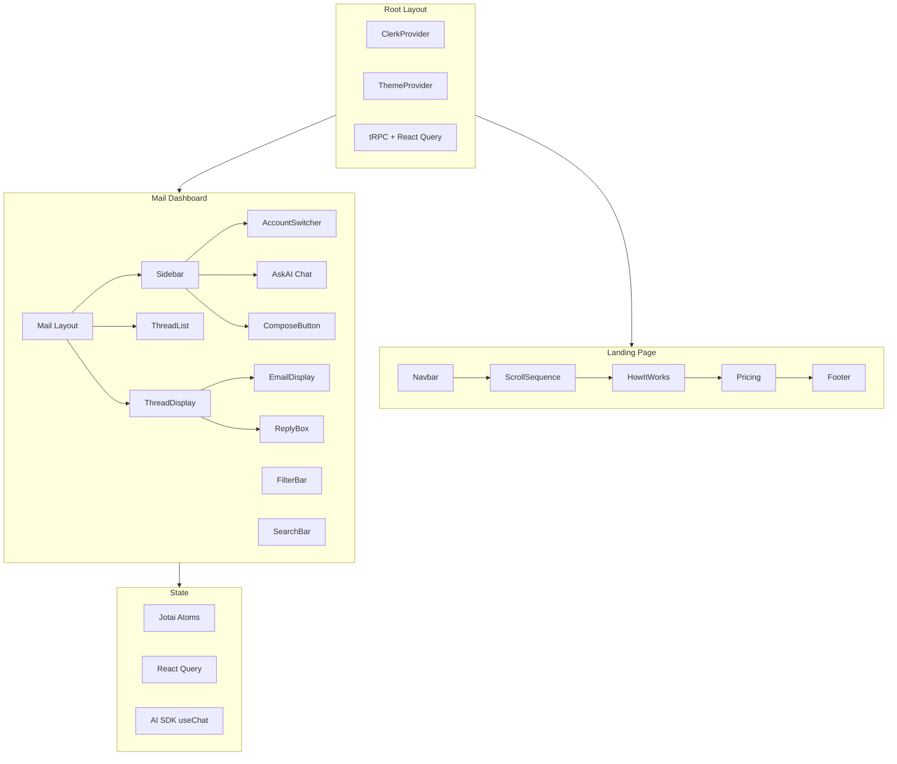

---

## 10. Deployment & Infrastructure

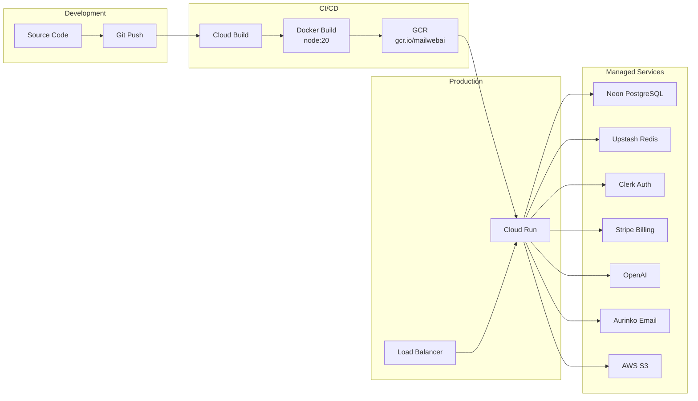

---

## 11. Billing & Subscription Flow

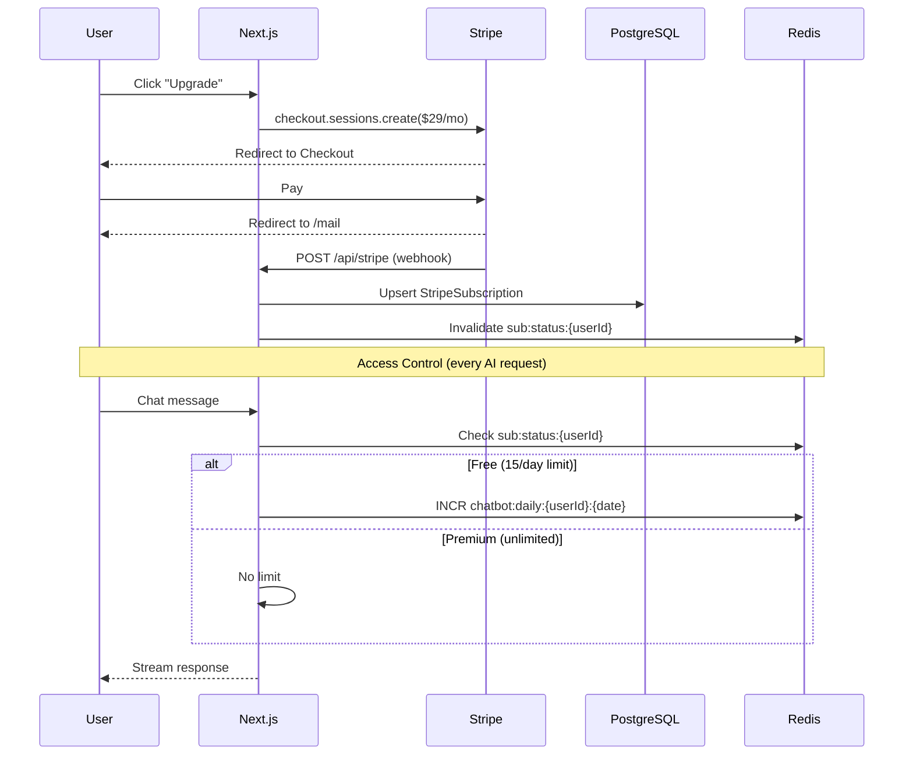

---

## 12. Search Architecture

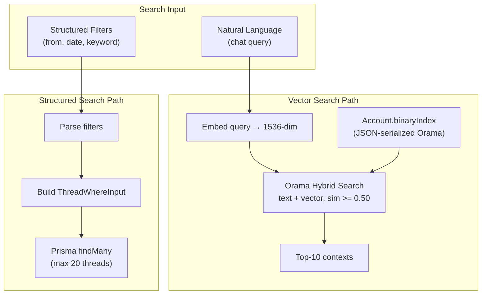

---

## 13. Redis Key Space

| Key Pattern | Purpose | TTL |
|---|---|---|
| `threads:{acct}:{tab}:{done}` | Thread list cache | 30s |
| `thread:{acct}:{threadId}` | Single thread | 60s |
| `threadcount:{acct}:{tab}` | Thread count | 30s |
| `accounts:{userId}` | User accounts | 300s |
| `sub:status:{userId}` | Subscription status | 300s |
| `chatbot:daily:{userId}:{date}` | Daily AI usage | Until midnight |
| `ratelimit:openai:requests` | Global RPM tracker | 60s |
| `ratelimit:openai:tokens` | Global token tracker | 60s |
| `user:rpm:{userId}` | Per-user RPM | 120s |
| `sync:dedup:{acct}:{eventId}` | Webhook dedup | 300s |

---

## 14. Error Handling & Resilience

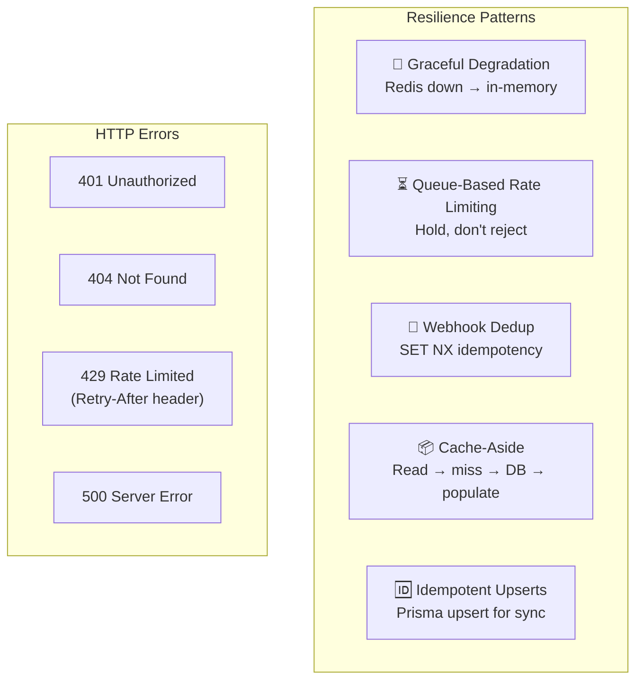

---

## 15. Technology Stack

| Layer | Technology | Purpose |
|---|---|---|
| **Framework** | Next.js 14 (App Router) | SSR, API routes |
| **Language** | TypeScript | Type safety |
| **Styling** | Tailwind CSS | Utility CSS |
| **UI** | Radix UI + shadcn/ui | Component primitives |
| **Animation** | Framer Motion | Landing animations |
| **State** | Jotai + React Query | Client + server state |
| **API** | tRPC v11 + REST | Type-safe RPC + streaming |
| **Auth** | Clerk | OAuth, sessions |
| **Database** | PostgreSQL (Neon) | Primary store |
| **ORM** | Prisma v5 | DB access |
| **Cache** | Upstash Redis | Caching + rate limiting |
| **Email** | Aurinko API | Gmail / Office365 |
| **AI** | OpenAI GPT-4.1-nano / ada-002 | Chat, completions, embeddings |
| **AI SDK** | Vercel AI SDK v3 | Streaming, tools |
| **Search** | Orama | Hybrid vector search |
| **Billing** | Stripe | Subscriptions |
| **Storage** | AWS S3 | File uploads |
| **Deploy** | Cloud Run + Cloud Build | Container hosting, CI/CD |
| **Container** | Docker (node:20) | Containerization |
| **Editor** | Novel (Tiptap) | Rich text composition |
