# MailWebAI — System Design Architecture

> Comprehensive system design covering infrastructure, data flow, caching, rate limiting, AI/ML pipeline, billing, and deployment.

---

## 1. High-Level System Architecture

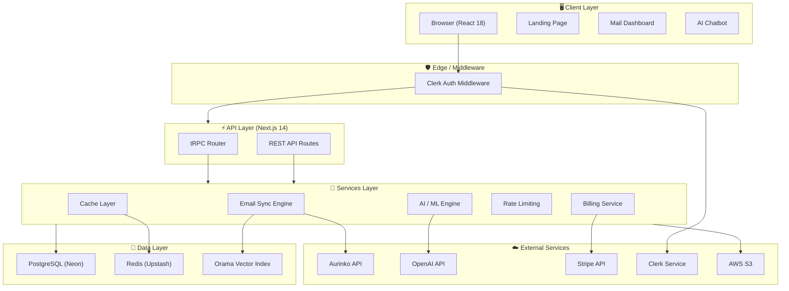

---

## 2. Request Flow & Authentication

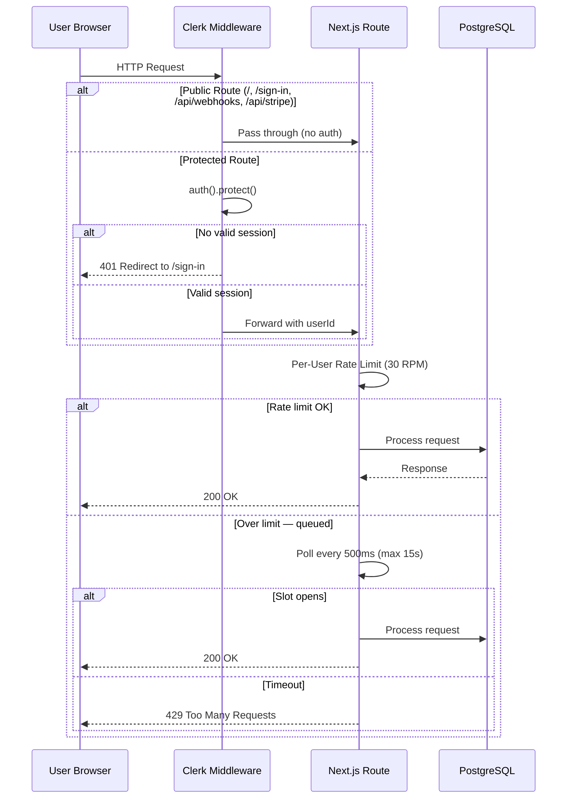

---

## 3. Data Model (ER Diagram)

```mermaid
erDiagram
    User {
        string id PK
        string emailAddress UK
        string firstName
        string lastName
        string imageUrl
        string stripeSubscriptionId FK
        enum role
    }

    Account {
        string id PK
        string userId FK
        json binaryIndex
        string token UK
        string provider
        string emailAddress
        string name
        string nextDeltaToken
    }

    Thread {
        string id PK
        string subject
        datetime lastMessageDate
        string accountId FK
        boolean done
        boolean inboxStatus
        boolean draftStatus
        boolean sentStatus
    }

    Email {
        string id PK
        string threadId FK
        datetime sentAt
        string subject
        string body
        string bodySnippet
        boolean hasAttachments
        enum emailLabel
        string fromId FK
    }

    EmailAddress {
        string id PK
        string name
        string address
        string accountId FK
    }

    EmailAttachment {
        string id PK
        string name
        string mimeType
        int size
        string emailId FK
    }

    StripeSubscription {
        string id PK
        string userId FK
        string subscriptionId UK
        string customerId
        datetime currentPeriodEnd
    }

    ChatbotInteraction {
        string id PK
        string day
        int count
        string userId FK
    }

    User ||--o{ Account : owns
    User ||--o| StripeSubscription : subscribes
    User ||--o| ChatbotInteraction : tracks
    Account ||--o{ Thread : contains
    Account ||--o{ EmailAddress : has
    Thread ||--o{ Email : contains
    Email }o--|| EmailAddress : from
    Email }o--o{ EmailAddress : to
    Email }o--o{ EmailAddress : cc
    Email ||--o{ EmailAttachment : has
```

---

## 4. Email Sync Pipeline

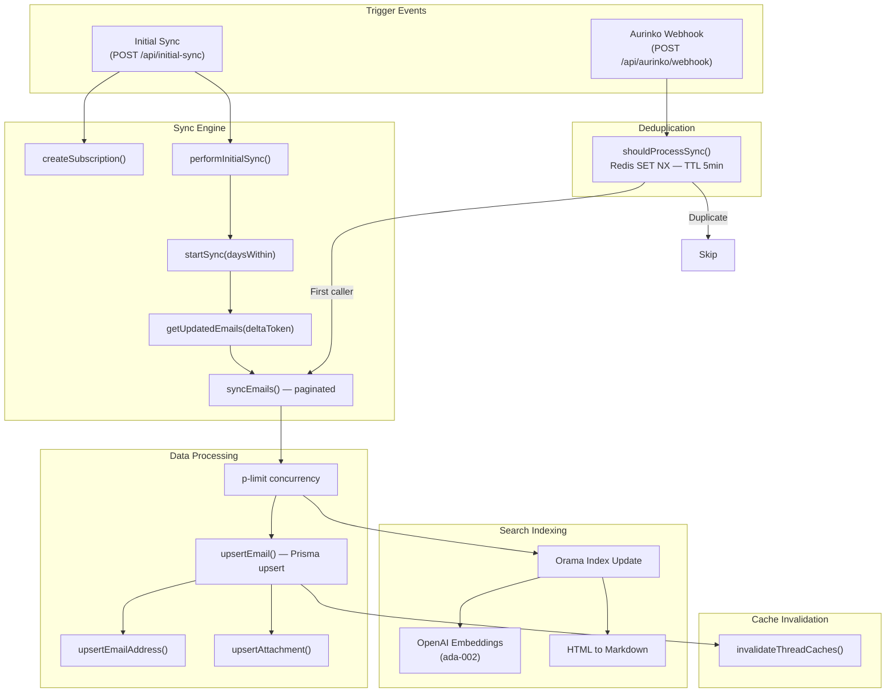

---

## 5. AI / ML Architecture

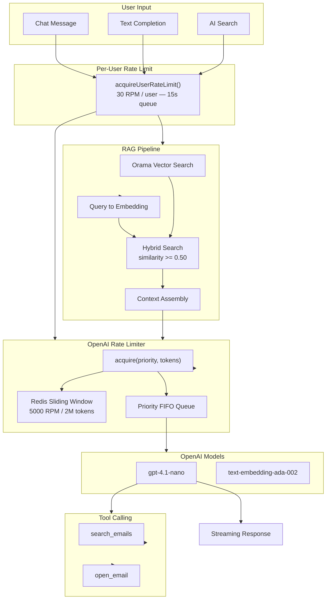

---

## 6. Caching Strategy

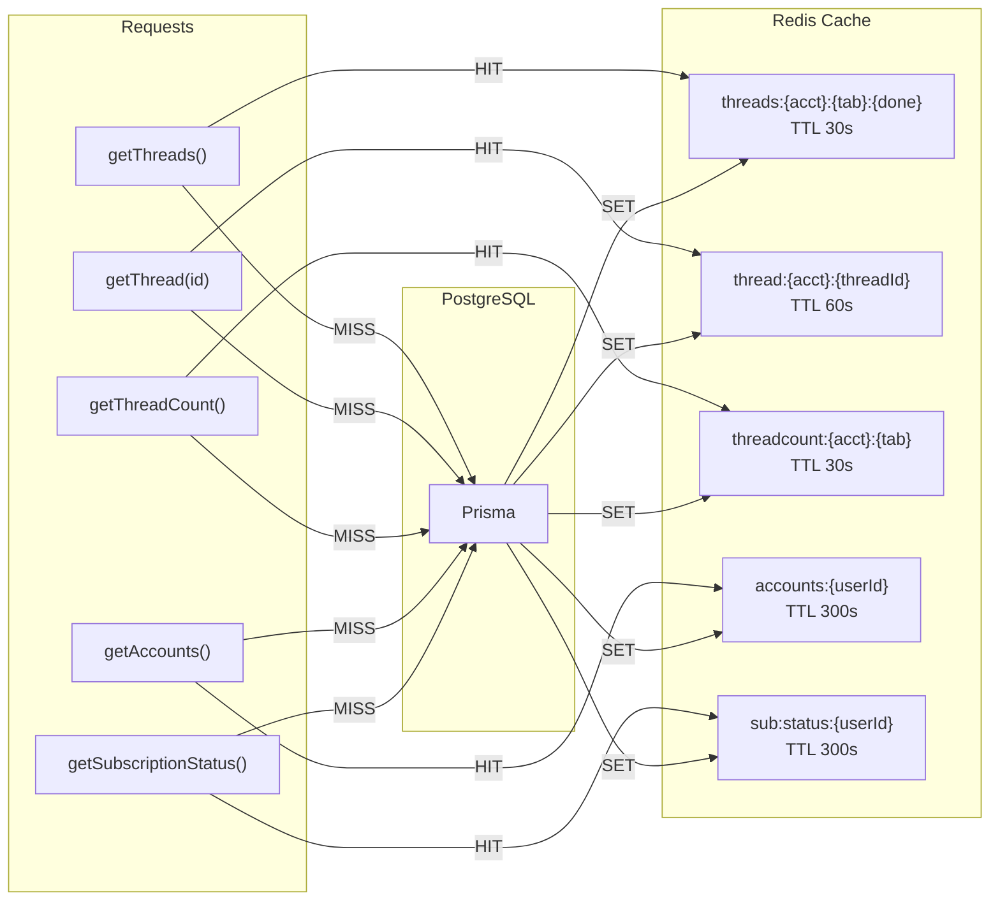

### Cache Invalidation Triggers

| Event | Keys Invalidated |
|---|---|
| Email sync | `threads:*`, `thread:*`, `threadcount:*` for account |
| Thread done/undone | `threads:*`, `thread:*`, `threadcount:*` for account |
| Mark as read | `thread:{id}` + `threads:*` lists |
| Stripe webhook | `sub:status:{userId}` |

---

## 7. Rate Limiting Architecture

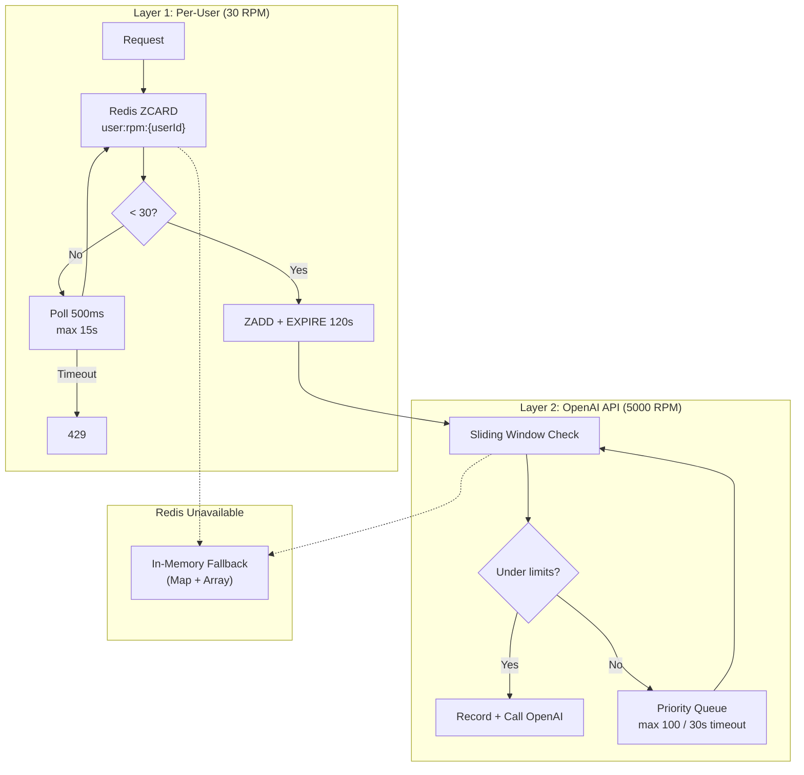

### Priority Levels

| Priority | Used By |
|---|---|
| `high` | Reserved |
| `normal` | Chat responses |
| `low` | Completion, embeddings |

---

## 8. API Route Map

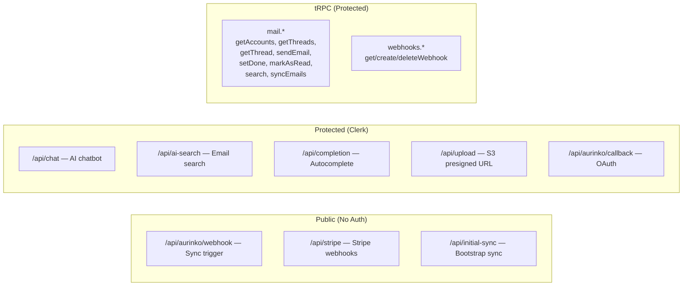

---

## 9. Frontend Component Architecture

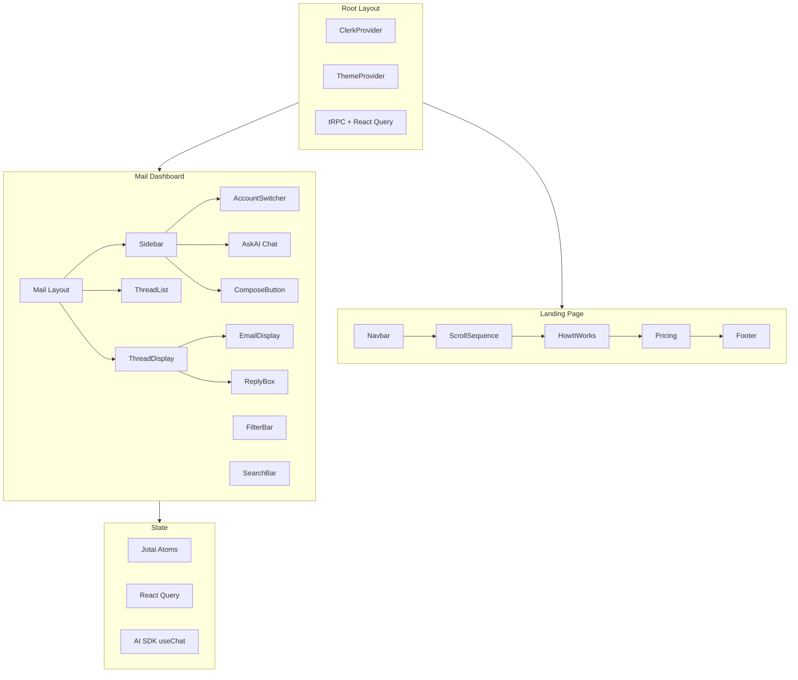

---

## 10. Deployment & Infrastructure

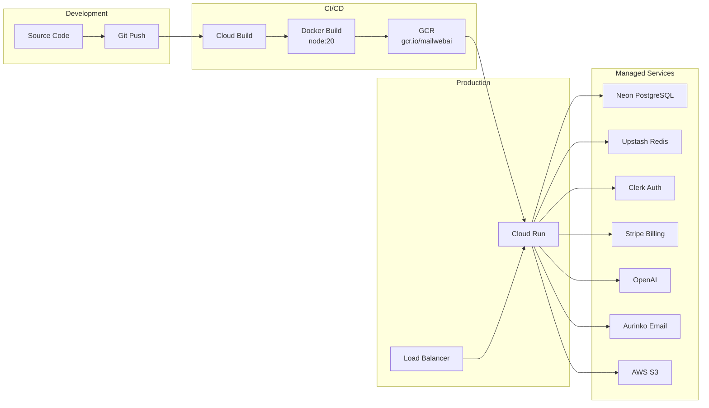

---

## 11. Billing & Subscription Flow

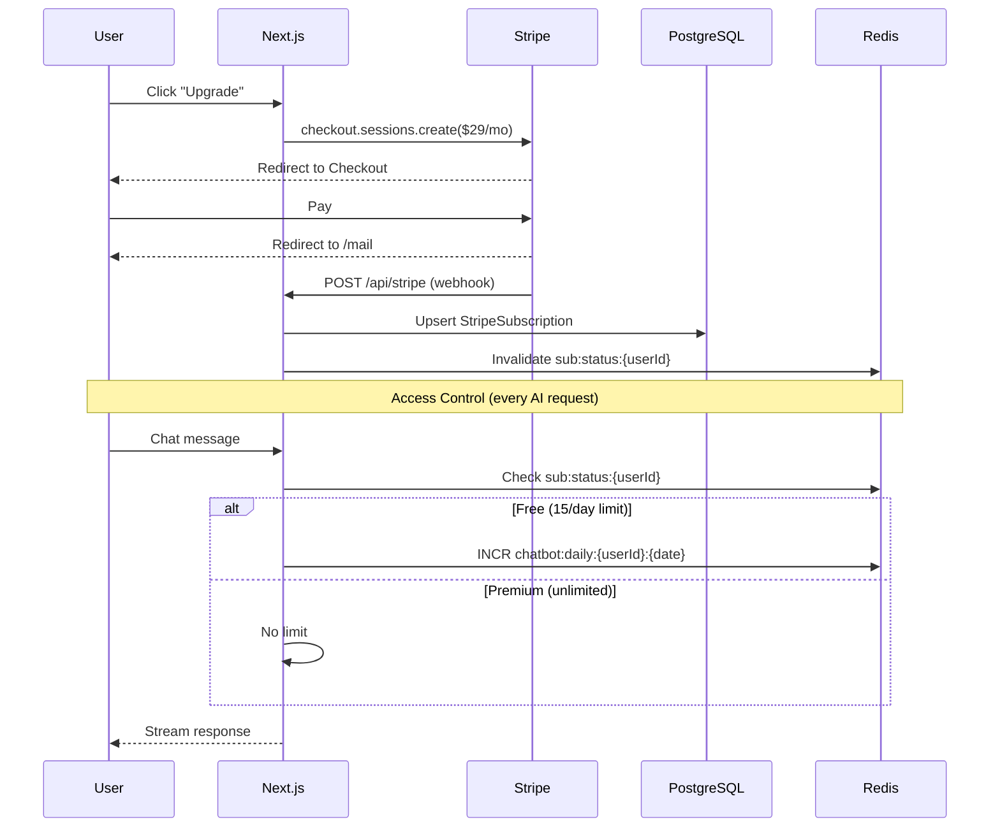

---

## 12. Search Architecture

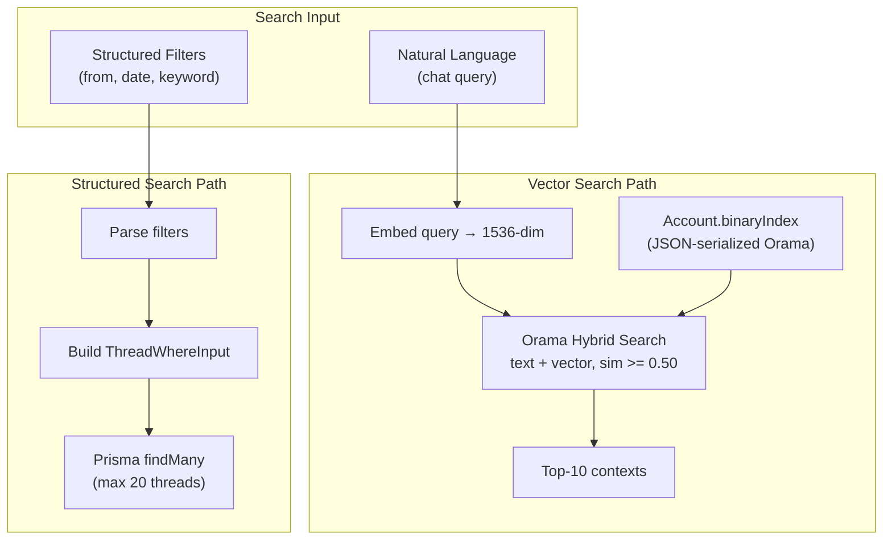

---

## 13. Redis Key Space

| Key Pattern | Purpose | TTL |
|---|---|---|
| `threads:{acct}:{tab}:{done}` | Thread list cache | 30s |
| `thread:{acct}:{threadId}` | Single thread | 60s |
| `threadcount:{acct}:{tab}` | Thread count | 30s |
| `accounts:{userId}` | User accounts | 300s |
| `sub:status:{userId}` | Subscription status | 300s |
| `chatbot:daily:{userId}:{date}` | Daily AI usage | Until midnight |
| `ratelimit:openai:requests` | Global RPM tracker | 60s |
| `ratelimit:openai:tokens` | Global token tracker | 60s |
| `user:rpm:{userId}` | Per-user RPM | 120s |
| `sync:dedup:{acct}:{eventId}` | Webhook dedup | 300s |

---

## 14. Error Handling & Resilience

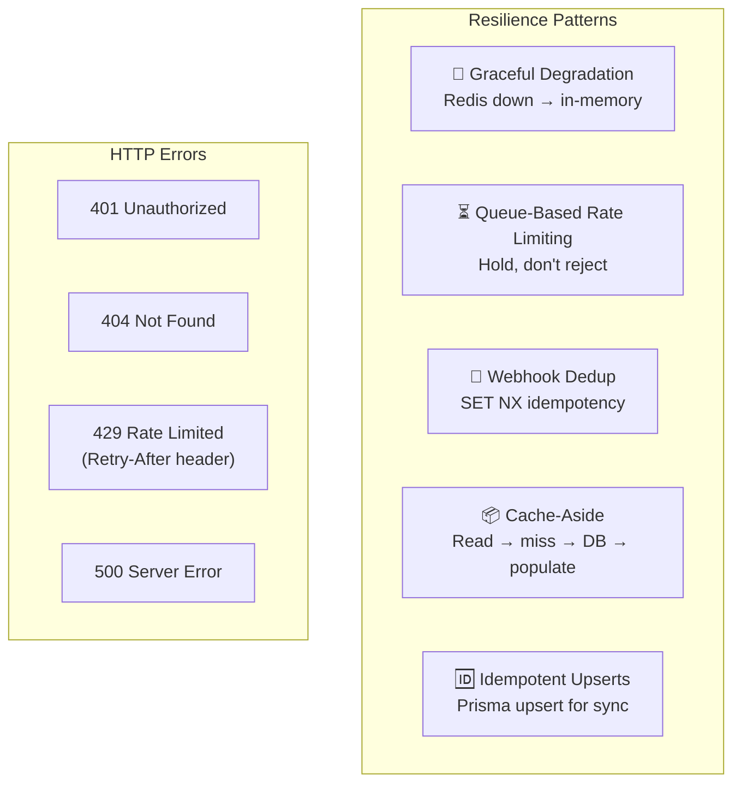

---

## 15. Technology Stack

| Layer | Technology | Purpose |
|---|---|---|
| **Framework** | Next.js 14 (App Router) | SSR, API routes |
| **Language** | TypeScript | Type safety |
| **Styling** | Tailwind CSS | Utility CSS |
| **UI** | Radix UI + shadcn/ui | Component primitives |
| **Animation** | Framer Motion | Landing animations |
| **State** | Jotai + React Query | Client + server state |
| **API** | tRPC v11 + REST | Type-safe RPC + streaming |
| **Auth** | Clerk | OAuth, sessions |
| **Database** | PostgreSQL (Neon) | Primary store |
| **ORM** | Prisma v5 | DB access |
| **Cache** | Upstash Redis | Caching + rate limiting |
| **Email** | Aurinko API | Gmail / Office365 |
| **AI** | OpenAI GPT-4.1-nano / ada-002 | Chat, completions, embeddings |
| **AI SDK** | Vercel AI SDK v3 | Streaming, tools |
| **Search** | Orama | Hybrid vector search |
| **Billing** | Stripe | Subscriptions |
| **Storage** | AWS S3 | File uploads |
| **Deploy** | Cloud Run + Cloud Build | Container hosting, CI/CD |
| **Container** | Docker (node:20) | Containerization |
| **Editor** | Novel (Tiptap) | Rich text composition |


# System Architecture

The following diagram illustrates the high-level architecture of the MailWebAI project, detailing the interactions between the client, external services, application layer, and data layer.

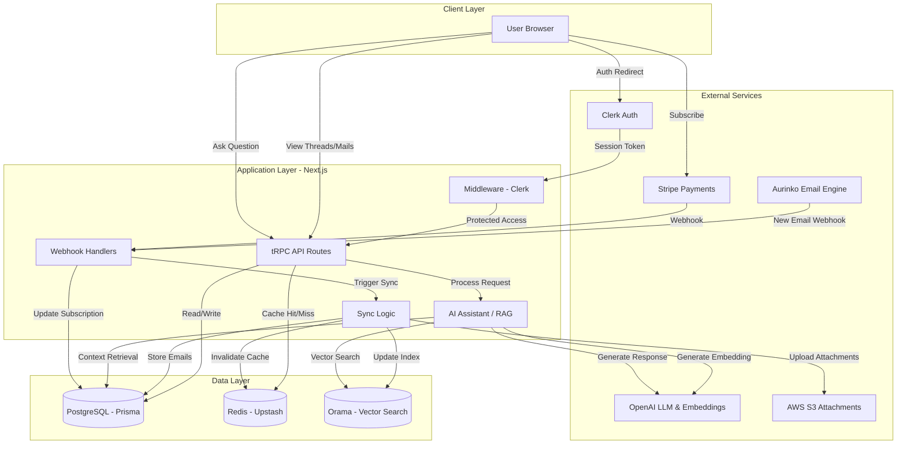


## Key Components

1.  **Frontend (Client Layer)**:
    *   Built with **Next.js 14 App Router** using React Server Components.
    *   Interacts with the backend primarily via **tRPC**.

2.  **Authentication**:
    *   **Clerk**: Handles user authentication, session management, and secure access control.
    *   **Middleware**: Intercepts requests to ensure valid sessions before access to protected routes.

3.  **Email Engine**:
    *   **Aurinko**: Connects to email providers (Google, Office365) and synchronizes data.
    *   **Webhooks**: Received from Aurinko trigger real-time sync processes in the application.

4.  **Backend Services (Application Layer)**:
    *   **tRPC API Routes**: Type-safe API endpoints for client-server communication.
    *   **Sync Engine**: Handles the logic for processing incoming emails, storing them, and updating search indexes.
    *   **AI Core (RAG)**: Retrieves relevant context using vector search and generates responses via OpenAI.

5.  **Data & Storage**:
    *   **PostgreSQL (Prisma)**: Primary database for persistent storage (Users, Threads, Emails).
    *   **Redis (Upstash)**: Provides caching for performance (e.g., thread lists) and manages API rate limits.
    *   **Orama**: specialized vector database for semantic search across emails.
    *   **AWS S3**: Secure object storage for email attachments.

6.  **Payments**:
    *   **Stripe**: Manages subscriptions and payment processing. Webhooks update user subscription status in the database.
  
# Email Sync System Architecture

## 1. Overview
The Email Sync system in MailWebAI is designed to provide a real-time, bidirectional mirror of the user's email account. It leverages **Aurinko** as the unified email API provider (supporting Google, Office365, etc.) and employs a multi-stage synchronization pipeline to ensure data consistency, performance, and AI-readiness.

## 2. High-Level Architecture

The system operates in two distinct modes: **Initial Sync** (bootstrapping) and **Delta Sync** (real-time updates via webhooks).

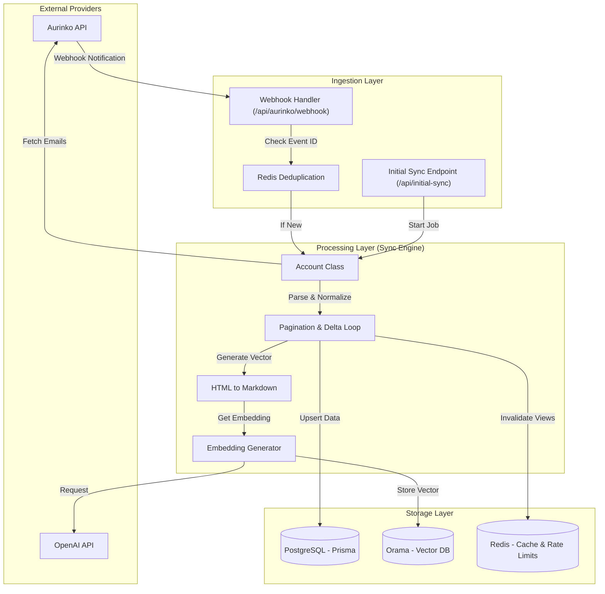

## 3. Core Components

### 3.1. Aurinko Integration (`src/lib/account.ts`)
*   **Provider**: Aurinko is used as the middleware to abstract IMAP/Graph API complexities.
*   **Authentication**: Uses Bearer tokens associated with the `Account` model in the database.
*   **Sync Strategy**:
    *   **Initial Sync**: Fetches emails from the last **3 days** (configurable). Polling mechanism checks for job completion (`ready` status).
    *   **Delta Sync**: Uses `deltaToken` to fetch only changes since the last sync.

### 3.2. Webhook Handling (`src/app/api/aurinko/webhook/route.ts`)
*   **Security**: Validates `X-Aurinko-Signature` using HMAC-SHA256 and the `AURINKO_SIGNING_SECRET`.
*   **Deduplication** (`src/lib/sync-dedup.ts`):
    *   Uses **Redis** (`setNX`) to prevent processing the same webhook event multiple times.
    *   Key format: `sync:dedup:{accountId}:{eventId}`.
    *   TTL: 5 minutes.
*   **Trigger**: Instantiates the `Account` class and triggers `syncEmails()`.

### 3.3. Sync Engine & Data Processing (`src/lib/sync-to-db.ts`)
The core logic resides in `syncEmailsToDatabase`. It processes batches of emails with controlled concurrency.

*   **Concurrency**: Uses `p-limit` to process up to **10 emails concurrently** during DB upserts.
*   **Address Normalization**:
    *   Extracts all unique email addresses (From, To, Cc, Bcc, ReplyTo) from a batch.
    *   Upserts them to the `EmailAddress` table first to ensure foreign key integrity.
*   **Thread Management**:
    *   Upserts `Thread` records given the `threadId` from Aurinko.
    *   Updates `lastMessageDate` and participant lists.
    *   **Folder Inference**: Determines if a thread is `inbox`, `sent`, or `draft` based on the labels of the emails contained within it.
*   **Email Storage**:
    *   Upserts `Email` records with full metadata (Subject, Body, snippet, etc.).
    *   Maps Aura-specific labels (e.g., `sysLabels`) to internal enums/booleans.

### 3.4. AI & Search Pipeline (`src/lib/sync-to-db.ts`, `src/lib/embeddings.ts`)
Every synced email is immediately prepared for RAG (Retrieval-Augmented Generation) and Semantic Search.

1.  **Text Extraction**: `turndown` library converts HTML email bodies to Markdown for cleaner LLM context.
2.  **Embedding Generation**:
    *   Uses `text-embedding-ada-002` via OpenAI.
    *   Request payload construction: `From: ... \n To: ... \n Subject: ... \n Body: ...`
    *   **Rate Limiting**: Embeddings are requested with `'low'` priority using the custom `OpenAIRateLimiter` to prevent saturating API quotas during bulk syncs.
3.  **Vector Storage**:
    *   **Orama**: A specialized vector database instance is initialized per user account (`OramaManager`).
    *   Inserts vectors alongside metadata (Thread ID, Timestamp) for hybrid search.

### 3.5. Caching & Invalidation (`src/lib/email-cache.ts`)
*   **Post-Sync**: Once a sync batch is complete, `invalidateThreadCaches(accountId)` is called.
*   **Mechanism**: Deletes Redis keys matching patterns for thread lists to ensure the frontend displays the latest data immediately.

## 4. Data Model (Prisma)

Key relationships enabling the sync architecture:

*   **Account**: Stores the `token` and `nextDeltaToken` (cursor).
*   **Thread**: Aggregates emails. Has computed flags (`inboxStatus`, `draftStatus`, `sentStatus`) for efficient querying.
*   **EmailAddress**: Normalized entity to allow graph-like queries (e.g., "all emails from X").
*   **Email**: The raw message unit. Stores `internetMessageId` for deduplication and `sysLabels` for folder categorization.

## 5. Error Handling & Resilience

*   **Webhook Retries**: Handled by Aurinko. Our deduplication logic ensures idempotency.
*   **Sync Failures**: 
    *   If `performInitialSync` fails, it logs the error and returns.
    *   Individual email processing errors (e.g., Prisma unique constraint race conditions) are caught and logged, preventing the entire batch from failing.
*   **Token Expiry**: Handled by the upstream `Account` class (not fully visible in sync logic but assumed handled during Aurinko API calls). 

## 6. Future Considerations / Scalability Limits
*   **Orama Persistence**: Currently, Orama indices might need to be persisted to disk or S3 to survive cold boots effectively if not using a cloud version.
*   **Queueing**: For extremely high usage, a dedicated message queue (e.g., BullMQ) between Webhook and Sync Engine would be better than `waitUntil`.


